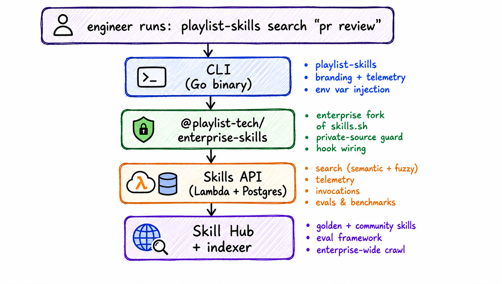

# Enterprise AI Skill Discovery & Distribution on Top of Vercel's skills.sh

> **TL;DR:** We built an enterprise skills ecosystem on top of Vercel's `skills.sh`: a private GitHub-wide skill index, internal search API, telemetry and invocation tracking, a wrapper CLI, and an eval framework for promoting high-quality Golden skills.

At Playlist, we have been investing heavily in AI-assisted engineering workflows. One pattern that has become central to that investment is the idea of **agent skills**. Reusable, versioned instruction sets that give your AI coding agent a specific capability, like reviewing PRs against your team's conventions, querying your internal metrics platform, or walking a non-engineer safely through a git workflow.

---

## Why skills.sh is a Great Starting Point

Vercel's [`skills.sh`](https://skills.sh) is an open ecosystem and CLI for AI agent skills. The core idea is elegant: a `SKILL.md` file is a markdown document with a YAML frontmatter block and a set of agent instructions. Any compatible agent (Claude Code, Cursor, Codex, GitHub Copilot, and many more) can read that file and immediately gain a new capability. The `skills` CLI handles discovery, installation, and lifecycle management.

Skills are installed locally into your agent's configuration, just copying text files to the right directories. The CLI writes hooks into the agent's config so the skill's instructions are injected automatically when you invoke it by name.

If you have not played with `skills.sh` yet, you might consider starting there. What we built assumes you have either tried it or are at least familiar with the concept.

---

## Why We Forked skills.sh

`skills.sh` is designed around a public ecosystem. Skills live on GitHub, telemetry flows to Vercel, and discovery means searching a public index. That works great for individual developers, but enterprise use introduces requirements the upstream tool wasn't built for:

**Discovery needs to span private repos:** Public skills are easy to find; ours aren't. We needed an internal index that crawls our entire GitHub Enterprise installation and makes skills searchable without requiring engineers to know which repo a skill lives in.

**Telemetry needs to stay internal:** We want our install, update, and removal numbers to be trackable allowing us to find skills that are highly used and might need to be promoted even more broadly. Keeping track of those means we need a way to pipe telemetry to a custom place rather than sending them to Vercel.

**Invocation needs to be trackable:** `skills.sh` knows when a skill is installed, but not when it is actually used. We added lifecycle hook wiring via `UserPromptSubmit` hooks that fire on every agent message so we can track when skills are invoked, allowing us to track popularity and performance.

The env var override pattern already existed in `skills.sh` — we just needed more of them, and a way to inject them automatically so engineers never had to think about it. That's what led to the CLI wrapper, covered below.


---

## The System We Built

We ended up with four components. Each has a distinct job, and together they form a complete closed loop: discover → install → use → observe → improve.



### 1. The Enterprise Fork of skills.sh

Rather than fork-and-diverge, we maintain a clean two-branch strategy: `main` tracks Vercel's upstream verbatim, and our `enterprise` branch holds our additions. An automated CI workflow runs hourly, detects new upstream commits, merges them using a union strategy, restores our enterprise-owned files (`package.json`, `README.md`, etc.), and auto-bumps the version (`<upstream-version>-enterprise.<n>`). If there's a conflict or a build failure, it opens a GitHub issue.

This means we stay current with upstream improvements without manual rebasing, and the version scheme makes it clear exactly which upstream release we're tracking.

#### Private-source telemetry gate

When you install a skill from a private GitHub repo, the fork checks repo visibility via the GitHub API and skips sending telemetry to Vercel. Data about private skills only goes to your own endpoint, and only if you've opted in.

#### Branding and API override layer

A thin `env-config.ts` layer reads `SKILLS_API_URL`, `SKILLS_CLI_NAME`, `SKILLS_LOGO`, `SKILLS_INSTALL_VERB`, and `SKILLS_FIND_VERB` at startup and threads them through every output string and API call -- full white-labeling without patching source files.

#### Lifecycle hook wiring

Skills can wire `UserPromptSubmit` hooks -- commands that fire each time a user sends a message to the agent. Each skill gets its own hook entry keyed by a `skillRef` identifier, so they can be added and removed independently. A `repair` command reconciles all installed agent configs against the lock file, wiring missing hooks and cleaning up orphaned ones. The lock file also ref-counts hook installations: if you've installed a skill globally and in two projects, the hook sticks around until the last one is gone. Worth noting: hook support varies by agent -- agents that don't expose prompt-submit lifecycle events still get full skill installation, they just won't report invocation telemetry.

---

### 2. The Skills Hub

This is the central repository for skills at Playlist, and it does two different jobs.

#### Where skills live

The repo has a two-tier structure:
- `skills/golden/` -- Platform-maintained skills, reviewed by the creator and maintainer of the skill, held to a formal quality bar (more on that below).
- `skills/community/` -- Engineer-contributed skills, no formal requirements. This is the proving ground.

#### The index engine

Every six hours, a CI pipeline crawls our entire GitHub Enterprise installation (across all of our GitHub organizations) using the GitHub code search API to find every `SKILL.md` file in every repo. It authenticates with a GitHub App so it can access private repos, uses incremental SHA-based diffing to only re-fetch files that changed, and upserts everything into a database. Skills that disappear from source are soft-deleted, not hard-removed.

The result is that if any team anywhere in the company writes a skill and pushes it to any repo, it shows up in the index within six hours -- with no registration step required. The discovery query itself is straightforward:

```python
def search_skill_files(org: str, session: requests.Session) -> list[dict]:
    results, page = [], 1
    while True:
        resp = session.get(
            "https://api.github.com/search/code",
            params={"q": f"filename:SKILL.md org:{org}", "per_page": 100, "page": page},
            timeout=30,
        )
        if resp.status_code == 403 and "rate limit" in resp.text.lower():
            wait = int(resp.headers.get("Retry-After", 60))
            time.sleep(wait)
            continue
        data = resp.json()
        items = data.get("items", [])
        results.extend(items)
        if len(items) < 100 or len(results) >= data.get("total_count", 0):
            break
        page += 1
        time.sleep(2)  # avoid secondary rate limits
    return results
```

GitHub's code search does the hard work -- you just iterate your orgs and page through results. One thing worth calling out: you'll want a GitHub App installed across all of your orgs rather than using a personal token. It gives you fine-grained read access to private repos, and installation tokens are short-lived and scoped per-org, which is much easier to manage at scale than rotating PATs.

---

### 3. The Skills API

The Skills API is the connective tissue. It runs as an AWS Lambda behind a private API Gateway (only reachable from inside the network) and serves four categories of requests:

#### Skill search
The search endpoint has three modes: a browse mode (empty query, returns everything sorted by tier and install count), semantic search (vector embeddings via Amazon Bedrock and pgvector, filtered by similarity threshold), and a fuzzy fallback (full-text + `ILIKE` matching on skill names, descriptions, and tags) for when semantic search comes up empty or Bedrock is unavailable. Each skill's embedding is generated at index time from its name, description, and tags.

#### Telemetry
A fire-and-forget beacon endpoint that records _install_, _remove_, _search_, and _update_ events from the CLI. To ensure that telemetry failures never disrupt the user's workflow, this endpoint always returns 204 regardless of outcome. The install count shown in search results is computed live from this data.

#### Invocation tracking
A two-phase endpoint that supports a start-call (recording that a skill is currently executing, with `succeeded = null` meaning "in-flight") and a stop-call (enriching the same row with duration, token counts, and success/failure). This is what gives us visibility into whether installed skills are actually being used.

#### Benchmark storage
Evaluation results from the CI pipelines are POSTed here and stored in a three-level hierarchy: a run record (what skill, what model, when), per-eval results (aggregate pass/fail), and per-expectation results (the individual assertion, its verdict, and the evidence string the judge cited). The benchmark data is decoupled from the live skill index and sticks around even if a skill is removed from the index.

---

### 4. The CLI Wrapper

The CLI is a small Go binary. It's the tool that engineers actually interact with and has the job of making the underlying npm-based system require zero user thought about configuration.

When you run any `playlist-skills` command, it:

1. Injects a set of Playlist-specific defaults as environment variables: the internal API URL, telemetry endpoint, branding strings, logo, and hook command templates.
2. Delegates to `npx @playlist-tech/enterprise-skills <args>` with those env vars set, inheriting full stdin/stdout/stderr so the upstream CLI's interactive TUI works transparently.

The injection is additive and non-destructive: it only sets variables that aren't already in the environment, so power users and CI pipelines can override any individual setting. 

The full pattern in Go looks like this:
```go
// defaults are only injected when the caller hasn't already set that variable.
var defaults = map[string]string{
    "SKILLS_API_URL":                 "https://skills.your-company.com",
    "SKILLS_TELEMETRY_URL":           "https://skills.your-company.com/api/telemetry",
    "SKILLS_TELEMETRY_ALLOW_PRIVATE": "1",
    "SKILLS_CLI_NAME":                "your-cli",
    "SKILLS_INSTALL_VERB":            "install",
    "SKILLS_FIND_VERB":               "search",
    "SKILLS_LOGO":                    yourLogo,
    "SKILLS_HOOK_START_CMD":          "your-cli track start --skill-ref {{skill_ref}} --agent {{agent}} --match-prompt /{{skill_name}}",
    "SKILLS_HOOK_STOP_CMD":           "your-cli track stop",
    "SKILLS_HOOK_FAIL_CMD":           "your-cli track stop --succeeded=false",
}

func skillsEnv(environ []string) []string {
    set := make(map[string]bool, len(environ))
    for _, e := range environ {
        if i := strings.IndexByte(e, '='); i > 0 {
            set[e[:i]] = true
        }
    }
    for k, v := range defaults {
        if !set[k] {
            environ = append(environ, k+"="+v)
        }
    }
    return environ
}
```

Then the command simply does:

```go
cmd := exec.Command("npx", append([]string{"--yes", "@playlist-tech/enterprise-skills"}, args...)...)
cmd.Env = skillsEnv(os.Environ())
cmd.Stdin, cmd.Stdout, cmd.Stderr = os.Stdin, os.Stdout, os.Stderr
```

Command translation handles the vocabulary differences. `playlist-skills search "pr review"` becomes `npx ... find "pr review"`. `playlist-skills install owner/repo@skill-name` becomes `npx ... add owner/repo@skill-name`. The verbs are ones that feel natural in Playlist's context.

Distribution is handled through Homebrew (macOS) and Scoop (Windows), both configured to authenticate against our private GitHub release artifacts using the user's existing `gh auth login` session. No PAT management, no custom registry config -- if you have the GitHub CLI authenticated, installing `playlist-skills` is one command.

On first use, the binary detects which AI tools you have installed (by checking for their config directories), wires the appropriate stop and prompt hooks, and records the state to a sentinel file. On subsequent runs it re-checks for newly-installed tools and prompts if it finds any. Engineers do NOT need to manually run any setup steps.

---

## The Evaluation Framework

The quality tier system would be meaningless without a way to verify it. For Golden skills, we built an LLM-as-judge evaluation framework.

Each Golden skill ships with an `evals/evals.json` file containing a set of eval prompts and expectations. An eval looks like:

```json
{
  "name": "Should suggest skill consolidation path",
  "prompt": "I have three separate skills that all do some variation of PR review. What should I do?",
  "expectations": [
    "Recommends running skill-2-gold to assess promotion readiness",
    "Does not suggest creating a fourth skill"
  ]
}
```

The eval runner runs each prompt once with the skill's `SKILL.md` as the system prompt, and once with only "You are a helpful assistant." For each response, a second LLM call (the judge) evaluates each expectation individually, returning a pass/fail verdict and a quoted evidence string from the response.

The metric that matters is the **delta**: the difference in pass rate between the "with skill" and "without skill" configurations. Our threshold is a 75-percentage-point delta -- the skill must improve pass rate by at least 75 points over the baseline. This is intentionally strict: it ensures skills are actually carrying instructional weight, not just getting credit for things Claude would do anyway.

CI runs evals on changed Golden skills on every merge to `main`, and runs the full suite daily for all Golden skills. Results are stored in the API and tracked over time, so we can detect skills that have degraded as model behavior changes.

The design choice to use a fast, cheap model for both execution and judging (currently `claude-haiku-4-5`) is deliberate. The matrix of runs per skill (N evals × 2 configurations × M runs each) adds up quickly, and Haiku is fast and cost-effective enough to run this continuously without meaningful expense. Installs tell you distribution; invocations tell you adoption; eval deltas tell you whether the skill actually matters.

The core of the runner is about 30 lines. The judge call is particularly simple:

```python
JUDGE_SYSTEM = (
    "You are an evaluation judge. "
    "Assess whether a model response satisfies an expectation. "
    "Do not infer intent — judge only what is explicitly present in the response."
)

def judge_expectation(client, judge_model: str, expectation: str, response_text: str) -> dict:
    resp = client.messages.create(
        model=judge_model,
        system=JUDGE_SYSTEM,
        messages=[{"role": "user", "content": (
            f"Expectation: {expectation}\n\n"
            f"Model response:\n{response_text}\n\n"
            "Does the response satisfy the expectation? "
            "Reply with JSON only: "
            '{"passed": true/false, "evidence": "<quote the relevant part>"}'
        )}],
        max_tokens=200,
        temperature=0,
    )
    return json.loads(resp.content[0].text.strip())

def run_eval(client, skill_md: str, eval_entry: dict, config: str, model: str) -> dict:
    system = skill_md if config == "with_skill" else "You are a helpful assistant."
    response_text = call_model(client, model, system, eval_entry["prompt"])

    results = [judge_expectation(client, model, exp, response_text)
               for exp in eval_entry["expectations"]]
    passed = sum(1 for r in results if r["passed"])
    return {"config": config, "pass_rate": passed / len(results), "details": results}

# Run both configs, compute the delta
with_skill  = run_eval(client, skill_md, eval_entry, "with_skill",    model)
without     = run_eval(client, skill_md, eval_entry, "without_skill", model)
delta = with_skill["pass_rate"] - without["pass_rate"]
```

A skill that scores 0.95 with and 0.90 without isn't pulling its weight -- the model would get most of the way there on its own.

---

## How It Comes Together for an Engineer

From an engineer's perspective, the workflow is:

1. `brew install playlist-tech/tap/playlist-skills` -- first-time setup, handled
2. `playlist-skills search "frontend best practices"` -- opens an interactive picker showing skills from across the company, with install counts and tier labels
3. Select a result to install the skill and wire the hooks automatically
4. Run `/skill-name` inside your AI coding tool (Claude Code, Codex, Cursor, GitHub Copilot, etc.) → the skill activates, the hook fires, invocation is tracked

When new Golden skills are published, no announcement is needed for discovery -- they show up at the top of search results ranked by tier. Community contributions from any squad appear in search automatically after the next index crawl.

---

## What's Next

A few things are in progress or on the near roadmap:

#### Skill bundles

We want to support a YAML or JSON bundle format allowing a single install target that fans out to install a curated collection of skills at once. An onboarding bundle, a backend-engineer bundle, a release-workflow bundle. One command, everything wired up.

#### Skill consolidation suggestions

As the community bucket grows, we are starting to see similar skills from different teams. We want to surface this and intelligently suggest consolidation candidates when the index finds skills with high semantic similarity, with the goal of converging toward more broadly-useful Golden skills rather than many near-duplicate one-offs.

#### A skills discovery UI

The CLI search works well for developers who are already in a terminal, but we want a web-based skill browser (similar to what skills.sh offers publicly) backed by the same index and search API. A place to browse tiers, read skill descriptions, see install counts, and find the right skill before ever opening a terminal.

#### Maturing the evaluation system

Our homegrown eval runner works well as a starting point, especially if you do not have access to third party platforms built for skill and general AI evaluations. That said, running and storing evaluations is a solved problem, and we have a contract with [Braintrust](https://www.braintrustdata.com) which makes it an easy choice to plan a migration for purpose-built tooling: dataset management, side-by-side run comparisons, regression tracking across model versions, and a UI for reviewing individual judge verdicts. Alongside that, we are working toward requiring evals for all Golden skills and tracking results over model releases so we can detect regressions proactively rather than after the fact.

---

## Build It Yourself

If this is a problem your organization has, the building blocks are mostly public.

#### Start with skills.sh

[vercel-labs/skills](https://github.com/vercel-labs/skills) handles the hard parts of installation across every major AI agent. Get familiar with it first.

#### You may not need to fork it at all

We designed `@playlist-tech/enterprise-skills` so other organizations can use it as a drop-in npm package without maintaining their own fork. The branding, API URL, telemetry endpoint, CLI name, and hook command templates are all controlled by environment variables at runtime -- `SKILLS_API_URL`, `SKILLS_CLI_NAME`, `SKILLS_LOGO`, `SKILLS_TELEMETRY_URL`, and so on. The pattern we use is a thin Go (or any language) CLI wrapper that injects those variables before delegating to `npx @playlist-tech/enterprise-skills`. The npm package handles everything else. If that approach sounds useful, you're welcome to use it -- open an issue or discussion on [the fork](https://github.com/playlist-tech/enterprise-skills) and we're happy to help.

#### Build discovery on top of GitHub's code search

The index problem is largely solved by `filename:SKILL.md org:<org>` search queries, as shown in the indexing snippet above. A GitHub App with read access across your orgs, a cron job, and a database with a simple API on top gets you most of the way there.

#### The eval framework can start simple

You don't need the full CI/API infrastructure on day one. The judge pattern explained above gets you a true MVP and helps you maintain quality over time. The structural insight is measuring the delta, not just the absolute pass rate.

The skills ecosystem, just like everything else in the AI space, is moving fast. Vercel's `skills.sh` gives the whole industry a common installation layer, which means skills written against it are interoperable across tools and organizations. That interoperability is worth betting on.

---

*Playlist's Developer Experience squad maintains this system. If you're building something similar and want to compare notes, reach us at [squad-dev-experience@playlist.com](mailto:squad-dev-experience@playlist.com).*
